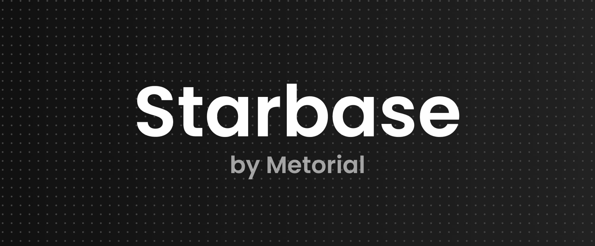

<h1 align="center">Starbase</h1>

<p align="center">
  <strong>Connect, explore, and test any MCP server with AI models</strong>
</p>

<p align="center">
  <a href="https://starbase.sh">🚀 Try Live Demo</a> •
  <a href="#-quick-start">Quick Start</a> •
  <a href="#-features">Features</a> •
  <a href="#-documentation">Documentation</a> •
  <a href="#-contributing">Contributing</a>
</p>

<p align="center">
  
  
</p>

## Motivation

[Model Context Protocol (MCP)](https://modelcontextprotocol.io) servers let AI models interact with tools and data sources. The problem is that testing and debugging them is difficult. When you're building an MCP server, you need to see if your tools actually work with real AI models. When you're evaluating existing servers, you need to understand what they do without diving into source code or setting up complex test environments.

Anthropic's [MCP Inspector](https://github.com/modelcontextprotocol/inspector) helps with basic inspection, but it doesn't let you actually test tools with AI models. You can see what's available, but you can't see how it behaves in practice.

Starbase solves this by letting you connect any MCP server and immediately test it with Claude, GPT-4, or other models. No setup, no boilerplate. You get a working environment to develop, test, and explore MCP servers.

> [!TIP]
> **Looking for production-ready MCP hosting?**
>
> [Metorial's serverless MCP platform](https://metorial.com) lets you deploy 600+ MCP servers with a single line of code. Includes logging, monitoring, and SDKs for seamless integration.
>
> ➡️ **[Get Started with Metorial](https://metorial.com)**

## Features

- **📡 Universal MCP Connectivity** - Connect to any remote MCP server with just a URL. No complex setup or configuration required.
- **🤖 Multi-Model Integration** - Test your MCP servers with leading AI models including Claude, GPT-4, and more. See how tools perform in real-world scenarios.
- **🔋 Batteries Included** - OAuth flows, client registration, connection management, and more are all handled automatically.
- **⚡ Interactive Playground** - Explore available tools, prompts, and resources from any MCP server through an intuitive interface.
- **🔧 Developer Friendly** - Perfect for developing and debugging MCP servers. Test your changes instantly without additional tooling.
- **🔒 Secure by Default** - Safe connection handling with proper authentication and authorization flows.
- **🎯 Zero Account Required** - Start testing immediately with our hosted version at [starbase.sh](https://starbase.sh).

## Quick Start

### Hosted Version (Recommended)

The fastest way to get started is to use our hosted version:

1. Visit [starbase.sh](https://starbase.sh)
2. Enter your MCP server URL
3. Start exploring and testing immediately

No installation, no account creation, no hassle.

### Local Installation

Want to run Starbase locally? Follow these steps:

#### Prerequisites

- Node.js 18+ or Bun
- PostgreSQL database (or any Prisma-supported database)

#### Installation

```bash
# Clone the repository
git clone https://github.com/metorial/starbase.git
cd starbase

# Install dependencies
npm install
# or
bun install

# Set up environment variables
cp .env.example .env
# Edit .env with your configuration

# Set up the database
npm run db:push
# or
bun run db:push

# Start the development server
npm run dev
# or
bun run dev
```

Visit `http://localhost:3000` to see Starbase in action!

## Documentation

### Project Structure

```
starbase/
├── app/           # Next.js app directory (pages, layouts, API routes)
├── components/    # React components
├── contexts/      # React context providers
├── lib/           # Utility functions and core logic
├── prisma/        # Database schema and migrations
└── types/         # TypeScript type definitions
```

### Tech Stack

- **Framework**: Next.js with App Router
- **UI**: React with Styled Components
- **AI SDKs**: Anthropic SDK, OpenAI SDK, Vercel AI SDK
- **MCP**: Official Model Context Protocol SDK
- **Database**: Prisma ORM with PostgreSQL
- **Authentication**: NextAuth.js v5
- **Language**: TypeScript

### Environment Variables

Create a `.env` file based on `.env.example` and configure:

```env
# Database
DATABASE_URL="postgres://..."

# Authentication (optional for local development)
AUTH_SECRET="your-secret-key"

# AI Model API Keys (optional - add only the models you want to use)
ANTHROPIC_API_KEY="your-anthropic-key"
OPENAI_API_KEY="your-openai-key"

# Other optional configurations
NEXT_PUBLIC_BASE_URL="http://localhost:3000"
```

### Available Scripts

- `npm run dev` - Start development server
- `npm run build` - Build for production
- `npm run start` - Start production server
- `npm run lint` - Run ESLint
- `npm run db:generate` - Generate Prisma client
- `npm run db:push` - Push schema changes to database
- `npm run db:migrate` - Run database migrations
- `npm run db:studio` - Open Prisma Studio

## Contributing

We welcome contributions from the community! Whether you're fixing bugs, adding features, improving documentation, or reporting issues, your help makes Starbase better for everyone.

### How to Contribute

1. **Fork the repository**
2. **Create a feature branch** (`git checkout -b feature/amazing-feature`)
3. **Make your changes**
4. **Commit your changes** (`git commit -m 'Add amazing feature'`)
5. **Push to the branch** (`git push origin feature/amazing-feature`)
6. **Open a Pull Request**

### Development Guidelines

- Write clear, descriptive commit messages
- Follow the existing code style and conventions
- Add tests for new features when applicable
- Update documentation for any changed functionality
- Ensure all tests pass before submitting

### Reporting Issues

Found a bug or have a feature request? Please check existing issues first, then create a new issue with:

- Clear description of the problem or suggestion
- Steps to reproduce (for bugs)
- Expected vs actual behavior
- Environment details (browser, OS, Node version, etc.)

## License

Starbase is licensed under the MIT License. See the [LICENSE](LICENSE) file for details.

## Acknowledgments

- Built on the [Model Context Protocol](https://modelcontextprotocol.io) by Anthropic
- Inspired by the need for better MCP development tools

## Links

- **Website**: [starbase.sh](https://starbase.sh)
- **Metorial Platform**: [metorial.com](https://metorial.com)
- **MCP Documentation**: [modelcontextprotocol.io](https://modelcontextprotocol.io)

<div align="center">
  <sub>Built with ❤️ by <a href="https://metorial.com">Metorial</a></sub>
</div>
  